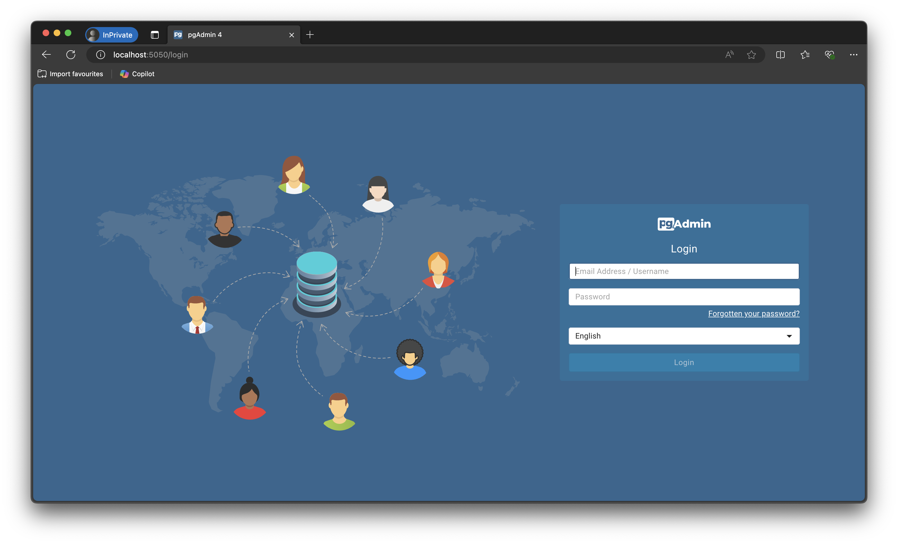
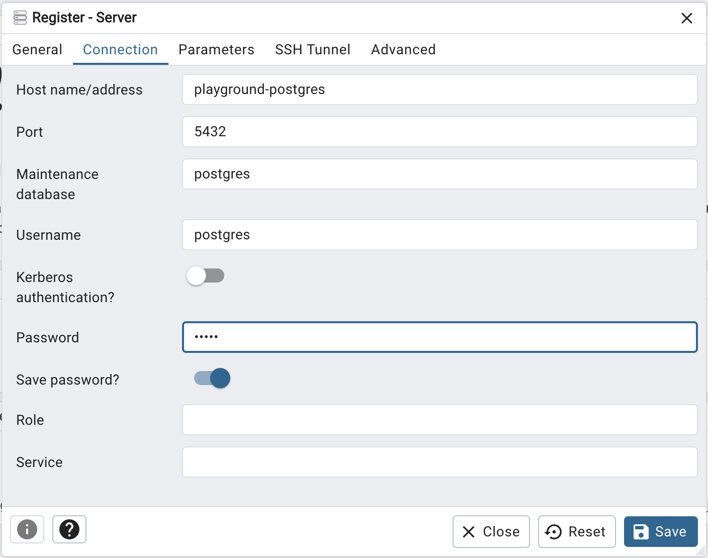
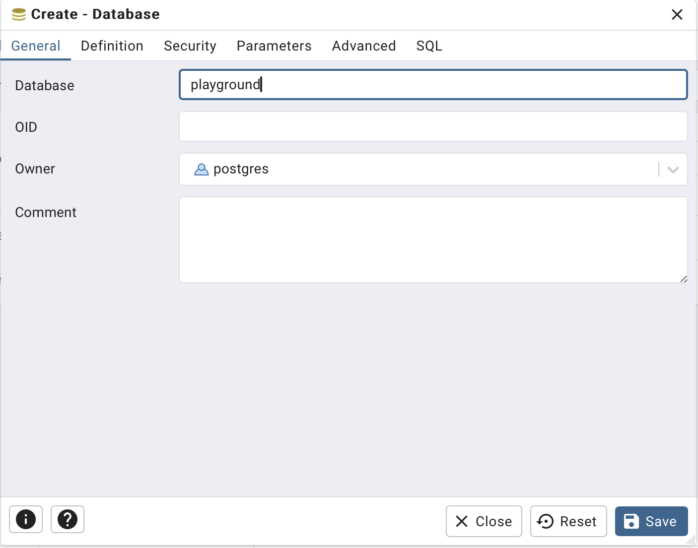
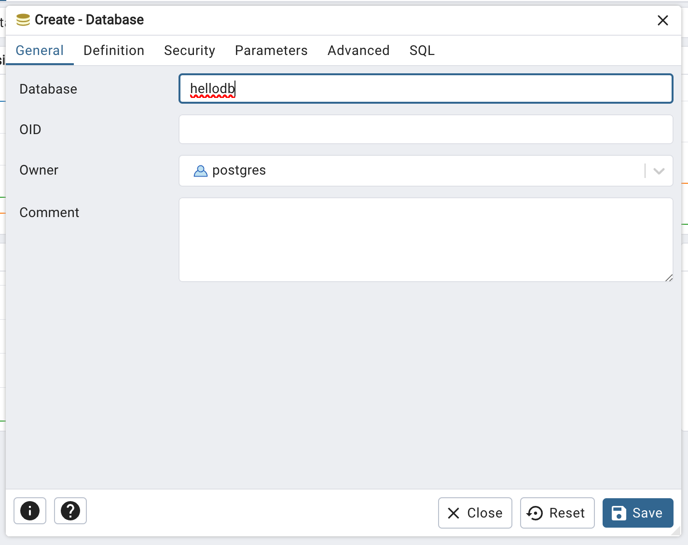
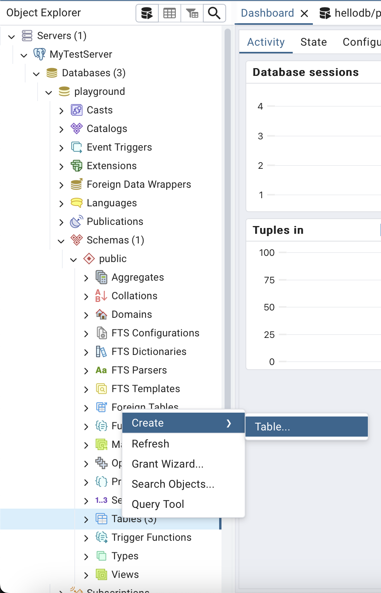
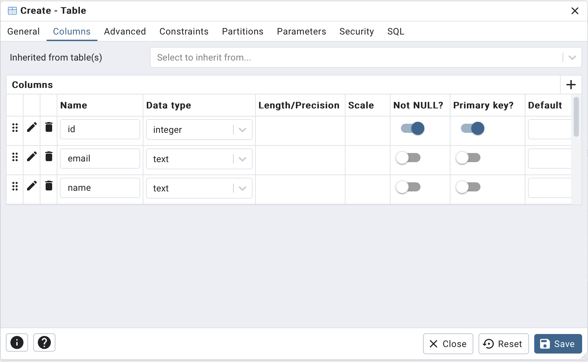
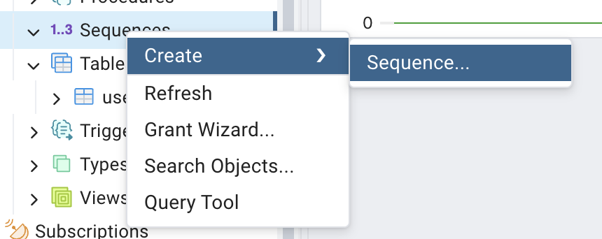
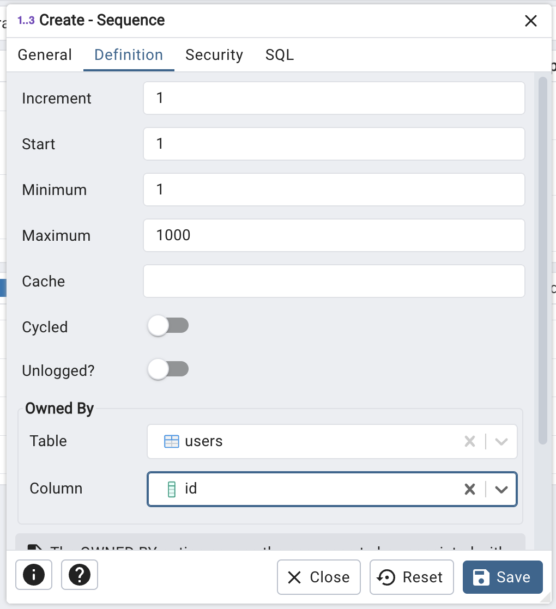
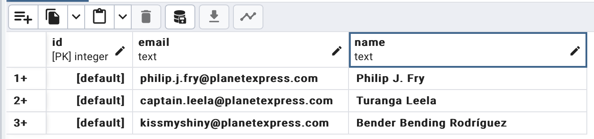
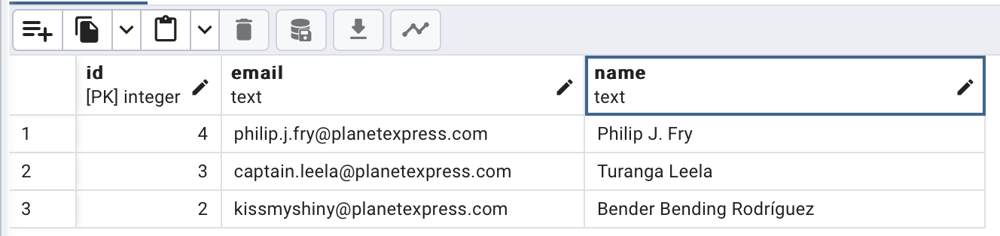

# Lesson 1: Set up the environment, create the first database, and make the first queries.

In this lesson, you’ll learn how to set up a PostgreSQL server using Docker, connect to the server with PGAdmin,
and create your first database and table. By the end of this lesson, you’ll have a basic understanding of how to
interact with PostgreSQL using both a graphical interface and SQL queries.

I’m expecting that you already have a Docker installed on your machine. Let’s install a PostgreSQL server and
[PGAdmin](https://pgadmin.org/), a UI to manage our server.

```bash
docker network create pg
docker run --network pg --name playground-postgres -p 5432:5432 -e POSTGRES_PASSWORD=hello -d postgres
docker run --network pg --name pgadmin-container -p 5050:80 -e PGADMIN_DEFAULT_EMAIL=artem@veikus.com -e PGADMIN_DEFAULT_PASSWORD=hello -d dpage/pgadmin4
```

Replace an email with yours in the 3rd command. We’ll use it as a login to a PGAdmin in the next steps.

## GUI way

After everything is installed, you can open http://localhost:5050/browser/ in your browser and will see an interface
of PGAdmin. Use your email and password “hello” to log in.



You can put any name on the “General” tab, then switch to the “Connection” tab. Here you’ll need to fill
in “Host name/address” to “playground-postgres” (same as the container name from the docker run command above),
the password as “hello,” and turn on the “Save password” toggle.



You can skip other settings for now and click “Save.”
PGAdmin will check if it can connect to the server and add it to a list on the left.

Let’s create a new database now. Right-click a newly created server and select “Create” → “Database”.



We can now set only a database name and leave all other properties default.



Now, let’s create a new table, so we can finally work with data. Open a newly created database and right-click
on “Schemas” → “public” -> “Tables” and Create a table.



Set a table name to “users” and create a few columns on the “Columns” tab. Click “+” on the right and make a column
for user ID and email. Add a “Primary key” for an “id” column.



If you’re familiar with MySQL, it automatically adds an auto-increment for the PRIMARY key.
Let’s add similar functionality to our table. Let’s create a sequence.



Let’s call it “user_id_seq” and link to our newly created table on the “Definition” tab.



Open the properties of the “users” table (by right-clicking on it and selecting “Properties”).
And add a default value for the “id” column as “nextval('user_id_seq'::regclass)”.

Now, we can finally create our first record. Go back to the “users” table, right-click on it,
and select “View/edit data” → “All rows.” Click “Add row” several times and write some emails in the “email” column.
Then click “Save Data Changes”.



Congratulations, you’ve created your first users.



## Command line way

Let’s check another way to make requests to the database. Open your favorite terminal and connect to
the PostgreSQL machine.

```bash
docker exec -it playground-postgres psql -U postgres
```

Select the previously created database by command:

```sql 
\c playground
```

Now you can get the list of the users by command:

```sql
SELECT * FROM users;
```

```text
 id |              email              |           name
----+---------------------------------+--------------------------
  2 | kissmyshiny@planetexpress.com   | Bender Bending Rodríguez
  3 | captain.leela@planetexpress.com | Turanga Leela
  4 | philip.j.fry@planetexpress.com  | Philip J. Fry
(3 rows)
```

Let’s create a few additional users.

```sql
INSERT INTO users (email, name) VALUES ('professor@planetexpress.com', 'Professor Hubert J. Farnsworth'), ('dr.zoidberg@planetexpress.com', 'Dr. John A. Zoidberg'), ('amy.wong@planetexpress.com', 'Amy Wong'), ('hermes.conrad@planetexpress.com', 'Hermes Conrad');
```

If you select users again, you’ll see that it was automatically incremented and users were added.

```text
 id |              email              |              name
----+---------------------------------+--------------------------------
  2 | kissmyshiny@planetexpress.com   | Bender Bending Rodríguez
  3 | captain.leela@planetexpress.com | Turanga Leela
  4 | philip.j.fry@planetexpress.com  | Philip J. Fry
  5 | professor@planetexpress.com     | Professor Hubert J. Farnsworth
  6 | dr.zoidberg@planetexpress.com   | Dr. John A. Zoidberg
  7 | amy.wong@planetexpress.com      | Amy Wong
  8 | hermes.conrad@planetexpress.com | Hermes Conrad
(7 rows)
```

That's all for today.